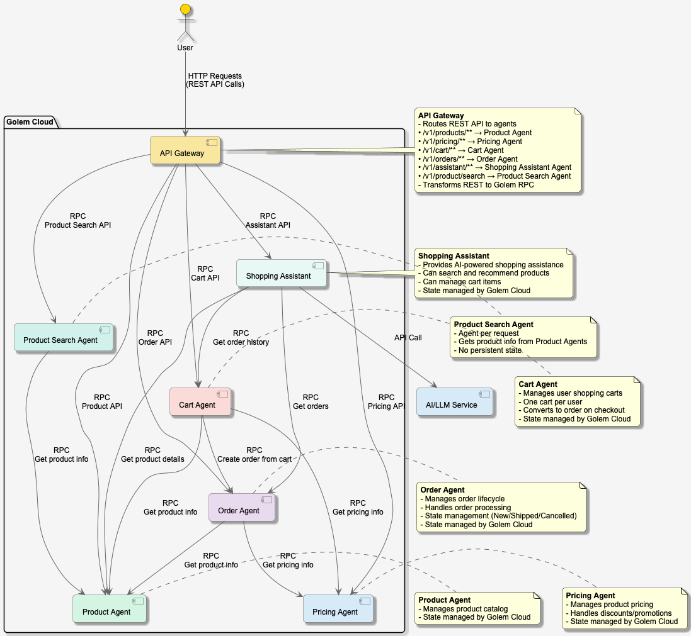

# golem-shopping-ts

This is a demo of a shopping app using Golem 1.4.

## Agents

- pricing: Pricing agent
- product: Product agent
- order: Order agent
- cart: Cart agent
- product-search: Product search agent
- shopping-assistant: Shopping assistant agent


### Architecture Overview

The following diagram illustrates the high-level architecture of the Golem Shopping application:



*Figure 1: Golem Shopping Application Architecture*

To view or edit this diagram, see the `architecture.puml` file in the project root. The diagram can be rendered using any PlantUML-compatible tool.


## Quick Start

1. **Prerequisites**:
    - Install [Golem CLI](https://learn.golem.cloud/cli) (version 1.4.0+)
    - [Running Golem Environment](https://learn.golem.cloud/quickstart#running-golem)

   See [Golem Quickstart](https://learn.golem.cloud/quickstart) for more information.


2. **Build and Deploy**:
   ```bash
   # Build all components
   golem-cli build
   
   # Deploy to Golem Network
   golem-cli deploy
   ```

3. **Import Sample Data**:
   For information on importing sample data, see the [Data README](./data/README.md).

4. **Run the Frontend**:
   See the [Frontend README](./frontend/README.md) for detailed frontend setup and development instructions.
